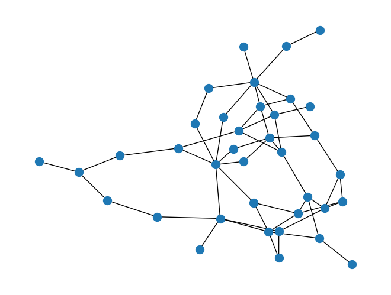

# Generative models for generating graphs

GAN implementation of generative model for graphs using TensorFlow in GoogleColab environment trained using power system network data generated by SynGrid.

This repository contains the code for creating the generative models for graphs as well as an example data that was created using a MATLAB package SynGrid.

## Author and reference

- [@jwu2012](https://www.github.com/jwu2012): Jiaxin Wu is the original author of the code.
- The graph generative model for network intrastructure is based on a paper that is referenced below:
  
Wu, Jiaxin, and Pingfeng Wang. "Generative design for resilience of interdependent network systems." Journal of Mechanical Design 145.3 (2023): 031705.

[Link to the paper](https://doi.org/10.1115/1.4056078)

## Output: Generated graph
Example of a 37 bus power system graph:
Figure created using python package NetworkX



(One of the graphs in pickled data file "37_node_dataset_df.p")

## Documentation
### Requirements
To allow users to freely access the code and try the training process, it is implemented in a Google Colab environment, where users are not required to have any installation for running the code. 
Python packages that are used in the code are installed and imported at the beginning blocks of the code.
If the user wishes to download the code and use it in a local environment, the following python packages must be installed
- tensorflow-gpu
- pandas
- numpy
- networkx

### How to use
The ipynb (python notebook) file "generative_grid_design_gan.ipynb" is the main code for the entire process.
The notebook has text explanations before each code block to give users information about the functions of each part of the code.

Overview of the process:
1. Preprocessing network data generated using SynGrid
2. Define network structure:
   - Generator
   - Graph convolutional network
   - Discriminator
3.Train the neural network (GAN)
4. Generate new data

### Preprocessing
If the dataset created by SynGrid is not processed yet, set the "load_and_save" to '1' in the third block. Afterwards, load the pickled file instead. 

* Processing the MATLAB data to extract features
  As the data is set in a MATLAB format, it is modified to a dataset that can be used in the standard python format through pandas.
  If the users network has different data structure, modify this section to fit the features of the data being used.

* Set graph parameters
  This block defines the number of nodes in the target graph and the dimensions of the node and edge features.
  The structure should be adjusted according to the preprocessing steps.

### Helper functions

#### get_adj_feat(data)
| Parameter | Type     | Description                       |
| :-------- | :------- | :-------------------------------- |
| `data`      | `list` | list of dataframes [node, edge, capacity] |

Converts the data = [node, edge, capacity] dataframe to [adjacency, features] tensors.

Adjacency tensor is structured as (edge feature, number of nodes, number of nodes) to define the connection relationship between nodes as well as the type of the edge connecting the nodes.

Feature tensor (matrix) is structured as (number of nodes, node features) to define the type for each node.

#### get_graph(adjacency, features)

Creates a graph using the adjacency tensor and features matrix from get_adj_feat

### Functions for generative modeling (GAN)

#### GraphGenerator(*params)
| Parameter | Type     | Description                       |
| :-------- | :------- | :-------------------------------- |
| `dense_units`      | `int list` | Keras: number of units for the fully connected layers |
| `dropout_rate`      | `float` | Keras: dropout layer |
| `latent_dim`      | `int` | Dimension of the latent space that the generative model sample |
| `adjacency_shape`      | `(int, int, int)` | Dimension of the adjacency tensor (edge information) |
| `feature_shape`      | `(int, int)` | Dimension of the feature matrix (node information) |

Create the generator of the GAN model

### Set parameters
Parameters specific to users can be changed using the code block under text "Set graph parameters"

Ex)
- NUM_NODES = 37 # defines the number of nodes (buses) in the graph
- NODE_DIM = 4+1 # number of node type: plus one for dummy indicating empty node
- EDGE_DIM = 3+1 # number of edge type: plus one for dummy indicating no edge
- LATENT_DIM = 64 # dimension size of the latent space that is used for generation

Parameters for training can be changed using the code block under text "Create GAN model and train"

Ex)
```ruby
wgan.compile(
    optimizer_generator=keras.optimizers.Adam(5e-4),
    optimizer_discriminator=keras.optimizers.Adam(5e-4),
)

# wgan.fit([adjacency_tensor, feature_tensor], epochs=30, batch_size=1)
wgan.fit([adjacency_tensor, feature_tensor], epochs=100, batch_size=32)
```
- optimization step size = 5e-4 # determines the step size during the optimization (Adam optimizer)
- epochs = 100 # determines how many epochs for the training process
- batch_size = 32 # determines the number of data samples used for each training epoch


### Building GAN model

#### GraphDiscriminator(*params)
| Parameter | Type     | Description                       |
| :-------- | :------- | :-------------------------------- |
| `gconv_units`      | `int list` | Number of units for the relational graph convolutional layers |
| `dense_units`      | `int list` | Keras: number of units for the fully connected layers |
| `dropout_rate`      | `float` | Keras: dropout layer |
| `adjacency_shape`      | `(int, int, int)` | Dimension of the adjacency tensor (edge information) |
| `feature_shape`      | `(int, int)` | Dimension of the feature matrix (node information) |

Create the discriminator of the GAN model

#### class RelationalGraphConvLayer(keras.layers.Layer)

Define trainable layers of the network: operation is defined in function 'call(inputs)'

| Parameter | Type     | Description                       |
| :-------- | :------- | :-------------------------------- |
| `inputs`      | `list` | list of data [adjacency, features] |

Graph convolutional network (GCN) implementation:

GCN: $H^{l+1}=\sigma(D^{-1}AH^lW^l)$, where $D$ is the degree matrix, $A$ is the weighted (feature induced) adjacency matrix, $W$ is the trainable weights (σ is the activation function)

#### class GraphWGAN(keras.Model)

GAN model using the generator (GraphGenerator) and discriminator (GraphDiscriminator):
Adjust training epochs and batch size according to the application. 

```ruby
wgan = GraphWGAN(generator, discriminator, discriminator_steps=1)
wgan.compile(
    optimizer_generator=keras.optimizers.Adam(5e-4),
    optimizer_discriminator=keras.optimizers.Adam(5e-4),
)
wgan.fit([adjacency_tensor, feature_tensor], epochs=100, batch_size=32)
```

### sample(generator, batch_size)
| Parameter | Type     | Description                       |
| :-------- | :------- | :-------------------------------- |
| `generator` | `function` | trained generator network (GraphGenerator) |
| `batch_size` | `int` | number of networks to generate |

Function 'sample' uses the trained generator to generate new graphs. It outputs the graph built using the generated adjacency tensor and features matrix.

In order to obtain the adjacency tensor and features matrix instead of the built graph, users can remove the last step of the sample function, where it uses get_graph helper function to obtain the graph.

```ruby
# Change the following return 
return [ get_graph(adjacency[i].numpy(), features[i].numpy()) for i in range(batch_size) ]
# to its parts
return [ [adjacency[i].numpy(), features[i].numpy()] for i in range(batch_size) ]
```


## MATLAB SynGrid
MATLAB SynGrid 
Refer to the repository for more details: [MATPOWER/SynGrid](https://github.com/MATPOWER/mx-syngrid)

For power system network graph generation, refer to the sample MATLAB code "gen_syngrid_main.m."
The example data under the folder "dataset_37_buses" was created using the sample code.

## Additional reference
- https://colab.research.google.com/github/keras-team/keras-io/blob/master/examples/generative/ipynb/wgan-graphs.ipynb
- https://colab.research.google.com/github/keras-team/keras-io/blob/master/examples/generative/ipynb/molecule_generation.ipynb
